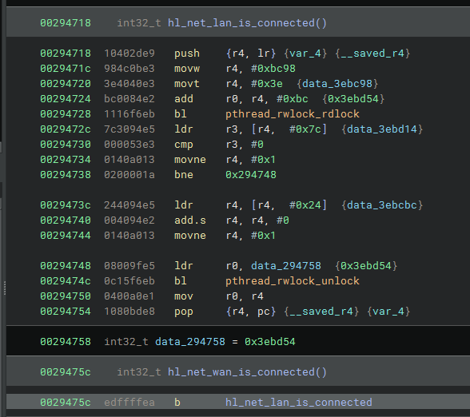
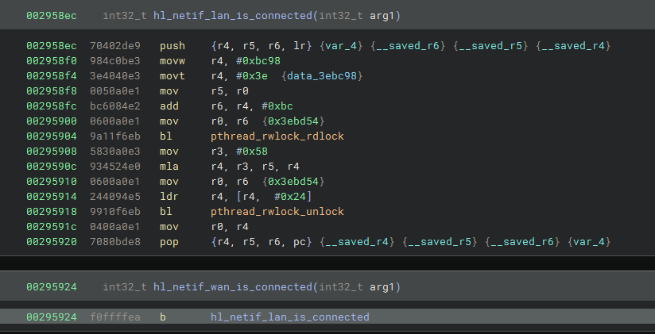
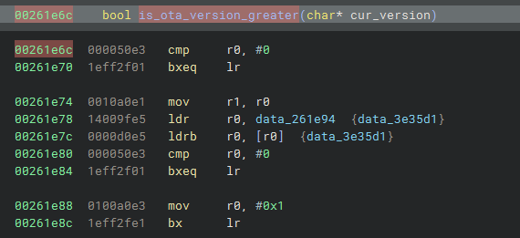

# OTA updates for OpenCentauri

This patch bundle patches 3 functions and 1 string:

- Patch [hl_net_wan_is_conncted](https://github.com/elegooofficial/CentauriCarbon/blob/e5c8dac7f8689a9a45e4153b80c6a6e3617f2b26/firmware/hl/devices/hl_net.c#L239) (sub_29475c) to redirect to hl_net_lan_is_connected (sub_294718) instead.

- Patch [hl_netif_wan_is_connected](https://github.com/elegooofficial/CentauriCarbon/blob/e5c8dac7f8689a9a45e4153b80c6a6e3617f2b26/firmware/hl/devices/hl_net.c#L646) (sub_295924) to redirect to hl_netif_lan_is_connected (sub_2958ec) instead.

- Patch [is_ota_version_greater](https://github.com/elegooofficial/CentauriCarbon/blob/e5c8dac7f8689a9a45e4153b80c6a6e3617f2b26/firmware/devices/ota.c#L1019) (sub_261e6c) to instead check if ota_ctx.info[OTA_FIREMARE_CH_SYS].version (data_3e35d1) is an empty string.

- Patch string "https://mms.chituiot.com/" to "https://u.opencentauri.cc/"